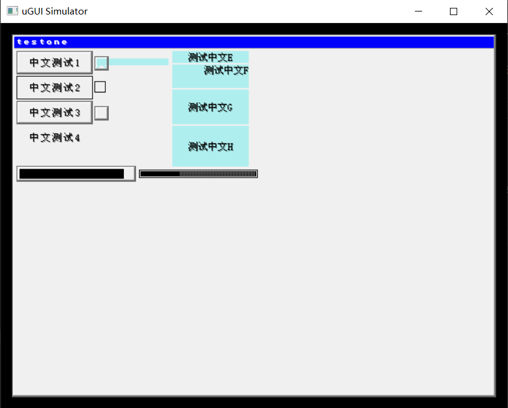

This is another form based on https://github.com/deividAlfa/UGUI with modifications:
1. Extended UTF8 support, no longer limited by the original algorithm's 0X8000 high bit flag method, which caused confusion for CJK characters whose unicode fall over 0X8000.
2. now the single character range for font conversion should be repeated once so that font range will appear in pairs.(unicode 169 has an offset:0x00,0xA9,0x00,0xA9 Flag:0x01,0x00)
3. Limited modification: The ".is_old_font" code still works,but font array need to update to new structure.
4. New C structure font array.
5. Ensure that the str pointer is correctly updated in the _UG_DecodeUTF8 function. This typically involves appropriately incrementing the pointer after identifying the number of bytes in the character.
6. Chinese Font is converted from Source Han Sans CN(Tool:https://github.com/agugu2000/ttf2ugui)
7. Simulation works normal for CJK characters

Simulator:
- ugui_sim.c / ugui_sim.h: platform independent application layer
- ugui_sim_sdl.c: SDL2 platform layer
- Build requires CMake 3.16+, MinGW-w64 on Windows or build-essential on Linux
- SDL2 source is bundled in deps/SDL-release-2.32.10.zip, extracted at configure time

Build:
  Windows (MinGW):
    cmake -S . -B build -G "MinGW Makefiles"
    cmake --build build -j
  Linux:
    cmake -S . -B build
    cmake --build build -j

Run:
  Windows: build\ugui_sim.exe
  Linux:   ./build/ugui_sim

------------------------------------------------------------------------------------------------

This is a forked version adding several enhancements: 
- Code reworked using [0x3333](https://github.com/0x3333/UGUI) UGUI fork.
- New font structure and functions. 
Fonts no longer require sequential characters, now they can have single chars and ranges, also support UTF8. 
This allows font stripping, saving a lot of space. 
- Add triangle drawing
- Add bmp acceleration (So the bmp data can be send using DMA), or use FILL_AREA driver if available. 
- Add 1BPP bmp drawing.
- 1BPP fonts can be drawn in transparent mode. 
- Modify FILL_AREA diver to allow passing multiple pixels at once.
- Font pixels are packed and only drawed when a different color is found. 
  This greatly enhances speed, removing a lot of overhead, specially when drawing big fonts. 

# Introduction
## What is µGUI?
µGUI is a free and open source graphic library for embedded systems. It is platform-independent
and can be easily ported to almost any microcontroller system. As long as the display is capable
of showing graphics, µGUI is not restricted to a certain display technology. Therefore, display
technologies such as LCD, TFT, E-Paper, LED or OLED are supported.

## µGUI Features
* µGUI supports any color, grayscale or monochrome display
* µGUI supports any display resolution
* µGUI supports multiple different displays
* µGUI supports any touch screen technology (e.g. AR, PCAP)
* µGUI supports windows and objects (e.g. button, textbox)
* µGUI supports platform-specific hardware acceleration
* Custom fonts can be added easily, several included by default, including cyrillic.
* TrueType font converter available: [ttf2uGUI](https://github.com/deividalfa/ttf2ugui)
* integrated and free scalable system console
* basic geometric functions (e.g. line, circle, frame etc.)
* can be easily ported to almost any microcontroller system
* no risky dynamic memory allocation required

## µGUI Requirements
µGUI is platform-independent, so there is no need to use a certain embedded system. In order to
use µGUI, only two requirements are necessary:
* a C-function which is able to control pixels of the target display.
* integer types for the target platform have to be adjusted in ugui_config.h.
