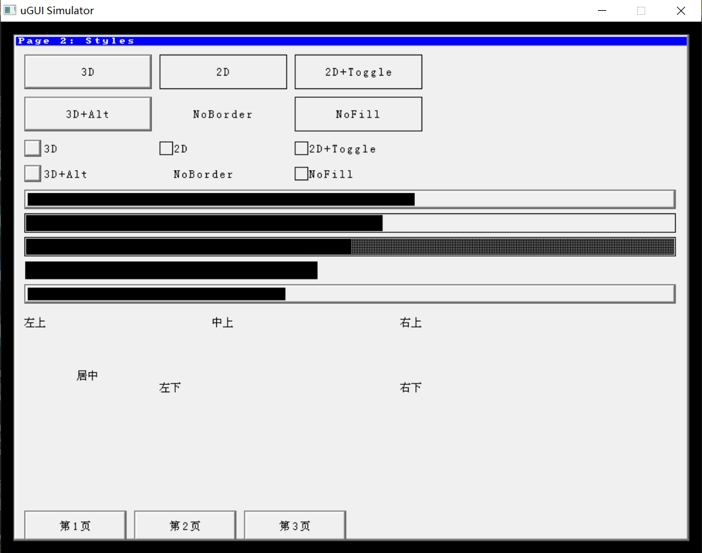
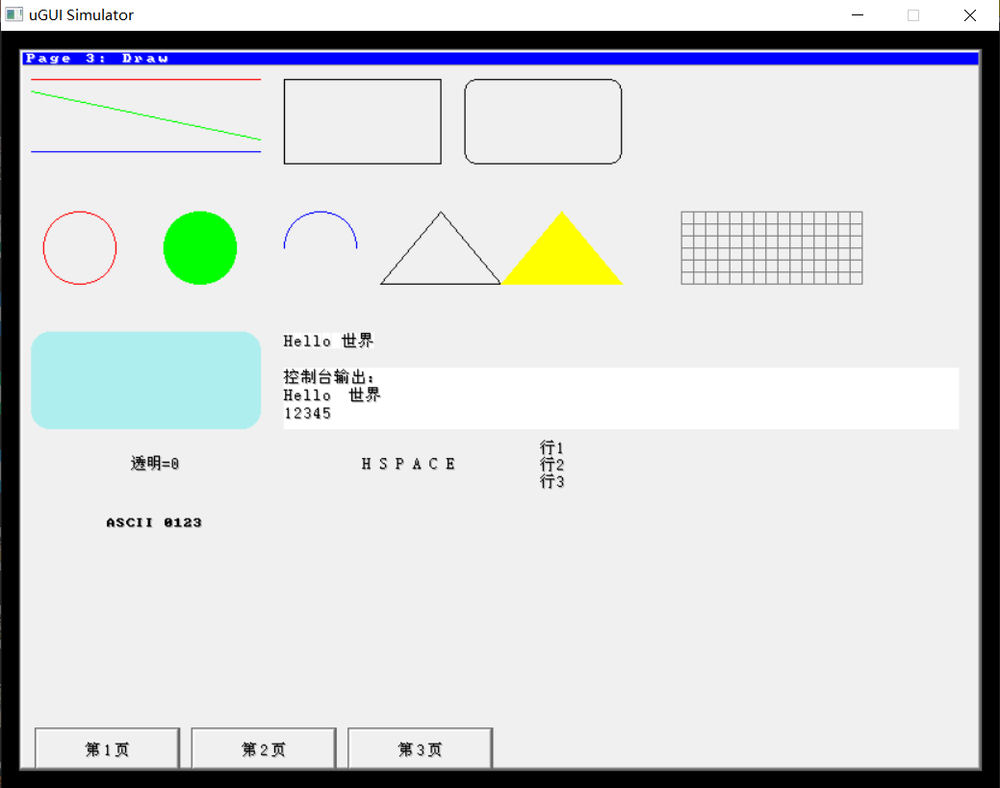

# µGUI (fork) — Extended Font, UTF-8, Shadow

Based on https://github.com/deividAlfa/UGUI with further modifications.

---

This is a fork based on https://github.com/deividAlfa/UGUI with the following features:

### Font

- New font format: tight bounding box + bearing + advance.
- Old font format still supported.
- Unified glyph descriptor `UG_GLYPH` (w, h, x_off, y_off, adv, bit_order, data).
- New format uses codepoints + metrics + data_offsets + data.
- 1BPP and 8BPP fonts supported.
- Font metrics: `UG_GetFontWidth`, `UG_GetFontHeight`,
  `UG_GetFontAscender`, `UG_GetFontDescender`, `UG_GetFontLineHeight`.

### UTF-8

- Extended UTF-8 support, no longer limited by the original 0x8000
  high-bit flag method, which caused confusion for CJK characters
  whose Unicode fall over 0x8000.
  (Note: upstream has already fixed this issue, but the fork this
  version is based on is older, so this note is kept for clarity.)
- Handles overlong encodings, invalid continuation bytes, truncated
  sequences, and codepoints above U+FFFF.

### Text rendering

- Unified renderer `_UG_PutGlyph` for 1BPP and 8BPP.
- Screen clipping via `_UG_ClipGlyph`.
- Draw order for 1BPP non-driver path:
  1. background (if not transparent)
  2. shadow
  3. body ink
- Supports transparency (`UG_FontSetTransparency`).

### Shadow / Outline

- `UG_FontSetShadow(0)` — no shadow (default)
- `UG_FontSetShadow(1)` — drop shadow (offset +1, +1)
- `UG_FontSetShadow(2)` — outline (8 directions)
- Only on 1BPP non-driver path.
- Driver path has no shadow (design trade-off).

### Objects

- Window, Button, Checkbox, Textbox, Progress, Image.
- Checkbox box size based on font line height.
- Checkbox box and text vertically centered in the object.

### Simulator

- SDL2, cross-platform.
- DPI scaling disabled for 1:1 pixel mapping.
- Three pages: Control / Styles / Draw.
- 16x16 RGB565 BMP test pattern.
- Shadow toggled per page.

### Chinese font

- Converted from SIMSUN2.
- Tool: https://github.com/agugu2000/ttf2ugui

### Note

Finally, note that I no longer have real hardware, so this is done
purely out of interest — to implement a complete GUI. Its efficiency
and memory footprint may no longer be suitable for real hardware.

---

Simulator:
- ugui_sim.c / ugui_sim.h: platform independent application layer
- ugui_sim_sdl.c: SDL2 platform layer
- Build requires CMake 3.16+, MinGW-w64 on Windows or build-essential on Linux
- SDL2 source is bundled in deps/SDL-release-2.32.10.zip, extracted at configure time

Build:
  Windows (MinGW):
    cmake -S . -B build -G "MinGW Makefiles"
    cmake --build build -j
  Linux:
    cmake -S . -B build
    cmake --build build -j

Run:
  Windows: build\ugui_sim.exe
  Linux:   ./build/ugui_sim

------------------------------------------------------------------------------------------------

deividAlfa:

This is a forked version adding several enhancements: 
- Code reworked using [0x3333](https://github.com/0x3333/UGUI) UGUI fork.
- New font structure and functions. 
Fonts no longer require sequential characters, now they can have single chars and ranges, also support UTF8. 
This allows font stripping, saving a lot of space. 
- Add triangle drawing
- Add bmp acceleration (So the bmp data can be send using DMA), or use FILL_AREA driver if available. 
- Add 1BPP bmp drawing.
- 1BPP fonts can be drawn in transparent mode. 
- Modify FILL_AREA diver to allow passing multiple pixels at once.
- Font pixels are packed and only drawed when a different color is found. 
  This greatly enhances speed, removing a lot of overhead, specially when drawing big fonts. 

# Introduction
## What is µGUI?
µGUI is a free and open source graphic library for embedded systems. It is platform-independent
and can be easily ported to almost any microcontroller system. As long as the display is capable
of showing graphics, µGUI is not restricted to a certain display technology. Therefore, display
technologies such as LCD, TFT, E-Paper, LED or OLED are supported.

## µGUI Features
* µGUI supports any color, grayscale or monochrome display
* µGUI supports any display resolution
* µGUI supports multiple different displays
* µGUI supports any touch screen technology (e.g. AR, PCAP)
* µGUI supports windows and objects (e.g. button, textbox)
* µGUI supports platform-specific hardware acceleration
* Custom fonts can be added easily, several included by default, including cyrillic.
* TrueType font converter available: [ttf2uGUI](https://github.com/deividalfa/ttf2ugui)
* integrated and free scalable system console
* basic geometric functions (e.g. line, circle, frame etc.)
* can be easily ported to almost any microcontroller system
* no risky dynamic memory allocation required

## µGUI Requirements
µGUI is platform-independent, so there is no need to use a certain embedded system. In order to
use µGUI, only two requirements are necessary:
* a C-function which is able to control pixels of the target display.
* integer types for the target platform have to be adjusted in ugui_config.h.
